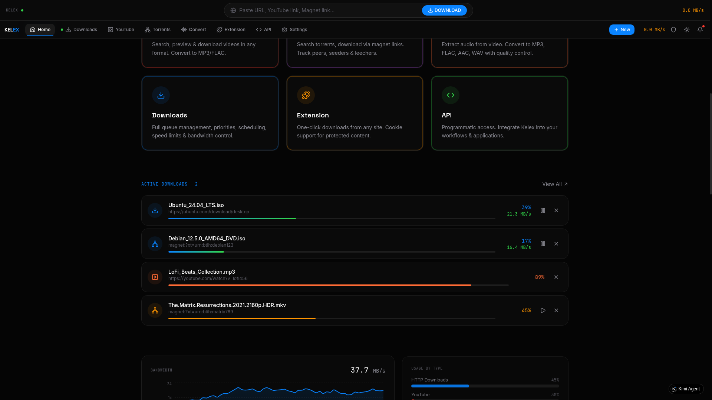
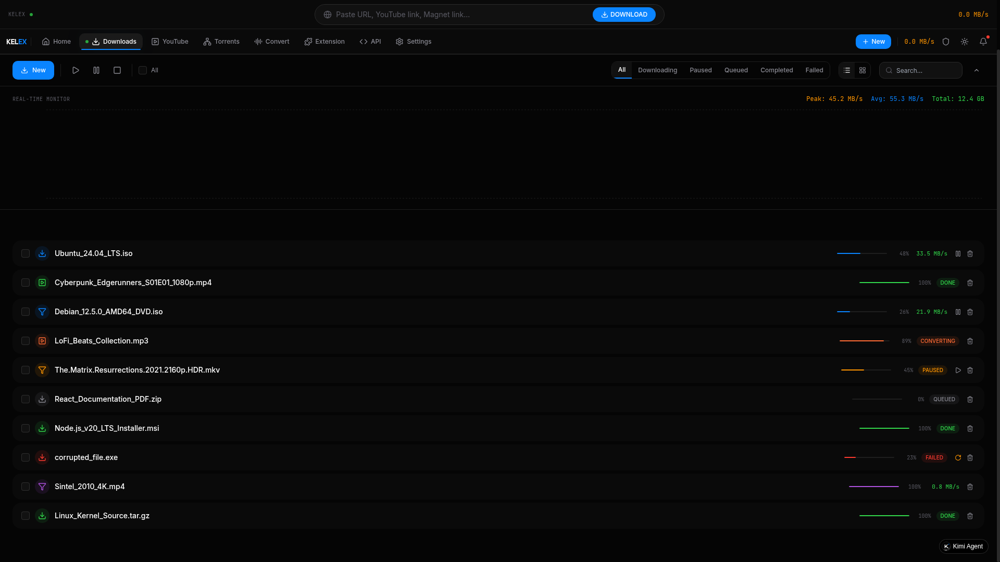
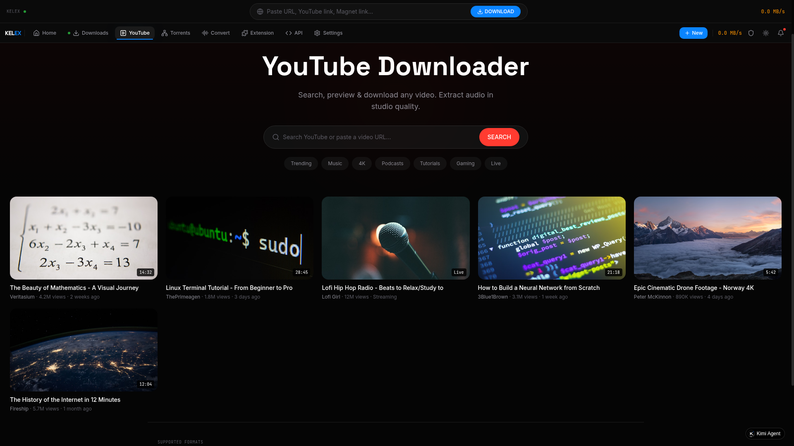
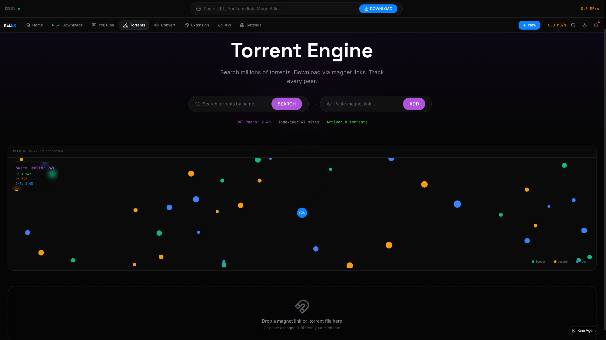
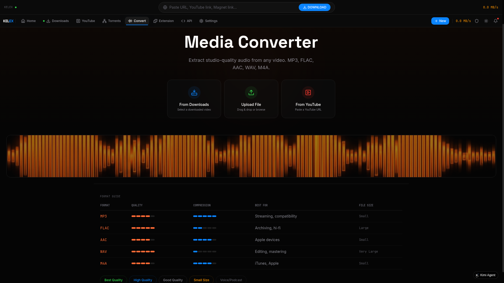
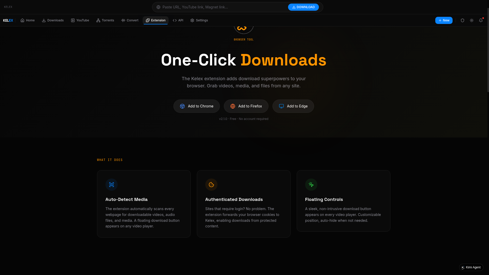
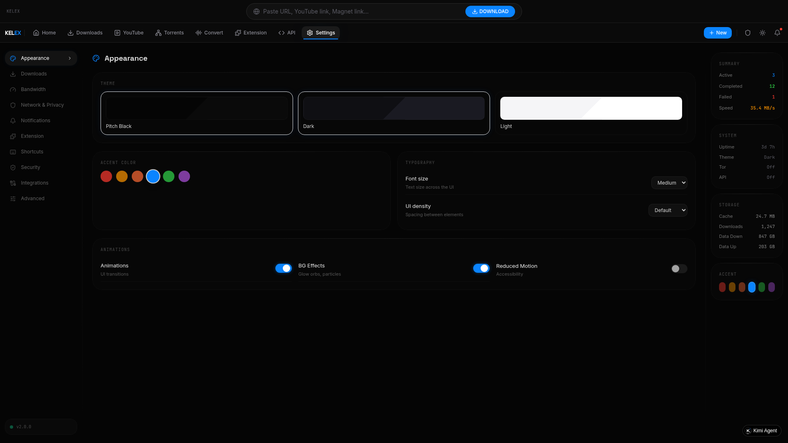

# Kelex Downloader

> Universal Download Manager. Download anything from anywhere at maximum speed.

**Live Demo:** https://aovlqz6pu4mem.kimi.page

---

## Table of Contents

- [Overview](#overview)
- [Screenshots](#screenshots)
- [Features](#features)
- [Architecture](#architecture)
- [Quick Start](#quick-start)
- [Installation](#installation)
- [Development](#development)
- [Deployment](#deployment)
- [Keyboard Shortcuts](#keyboard-shortcuts)
- [API Reference](#api-reference)
- [Desktop App](#desktop-app)
- [Docker](#docker)
- [Configuration](#configuration)
- [Tech Stack](#tech-stack)
- [Contributing](#contributing)
- [License](#license)

---

## Overview

Kelex is a powerful, universal download manager built as a modern web application. It can download any media from any website given a URL -- YouTube videos (with all formats), torrents, magnet links, regular HTTP files, and more. Features include video-to-audio conversion (MP3/FLAC), Tor privacy mode, browser extension integration, real-time download monitoring, and a REST API for programmatic access.

### Design Philosophy

- **Pitch-black UI** with premium accent colors (Red, Amber, Orange, Blue, Green, Violet)
- **Glassmorphism** aesthetic with subtle transparency and depth
- **Real-time** -- live speed graphs, progress bars, peer tracking
- **Dark/Light theme** with smooth animated transitions
- **Responsive** -- works on desktop, tablet, and mobile

---

## Screenshots

### Home Dashboard


The command-center dashboard with:
- Universal URL input bar with auto-type detection (YouTube, Magnet, HTTP)
- 8 quick-action feature cards (YouTube, Torrents, Convert, Downloads, Extension, API, and more)
- Active downloads preview with real-time progress
- Live speed graph with bandwidth monitoring
- Feature showcase with scroll animations

### Downloads Manager


Full download management with:
- 6 stat cards (Active, Paused, Queued, Completed, Failed, Speed)
- Toolbar with batch operations (Play All, Pause All, Stop All)
- Filter tabs (All, Downloading, Paused, Queued, Completed, Failed)
- Custom styled checkboxes for batch selection
- Inline progress bars with speed/percentage/status
- Play/Pause/Retry/Delete action buttons per row
- Collapsible real-time speed graph panel

### YouTube Downloader


YouTube search and download with:
- Search bar with trending tags (Trending, Music, 4K, Podcasts, Tutorials, Gaming, Live)
- Video results grid with thumbnails, duration, channel, views
- Format selection: MP4, WEBM, MKV (4K, 1080p, 720p, 480p, 360p, 240p, 144p)
- Audio extraction: MP3, FLAC, AAC, WAV, M4A
- Bitrate control (64kbps -- 320kbps)
- Quality presets (Best Quality, High Quality, Good Quality, Small Size, Voice/Podcast)

### Torrent Engine


Torrent search and download with:
- Search across 47 indexed sites
- Magnet link support with paste-and-add
- **Canvas peer network visualization** -- animated nodes showing seeder/leecher/peer connections
- Swarm health monitoring (Seeds, Leechers, DHT peers)
- Drag-and-drop .torrent file zone
- DHT peer tracking (2.4M+ peers)

### Media Converter


Video-to-audio conversion with:
- 3 source options: From Downloads, Upload File, From YouTube
- 5 output formats: MP3, FLAC, AAC, WAV, M4A
- Format comparison guide (quality, compression, best use, file size)
- Quality presets (Best, High, Good, Small, Voice/Podcast)
- Animated waveform visualization
- Bitrate slider (64kbps -- 320kbps)
- Batch conversion support

### Browser Extension


Browser extension page with:
- Download buttons for Chrome, Firefox, Edge
- Feature showcase: Auto-Detect Media, Authenticated Downloads, Floating Controls
- Setup guide with step-by-step instructions
- FAQ accordion
- Screenshot gallery

### Settings


Comprehensive settings with glassmorphism UI:
- **Appearance**: Theme picker (Pitch Black / Dark / Light), 6 accent colors, font size, UI density, animation toggles
- **Downloads**: Folder path, auto-start, auto-retry, max retries, auto-extract, duplicate check, clipboard monitoring
- **Bandwidth**: Speed limiter (download/upload sliders), max concurrent, connections per download, connection timeout, buffer size, weekly scheduling calendar
- **Network & Privacy**: Tor toggle with connection status, proxy settings (HTTP/HTTPS/SOCKS5/SOCKS4), authentication, custom user agent, referer policy, SSL verification, DNS over HTTPS, tracker blocking
- **Notifications**: Download complete/failed/conversion events, sound effects, desktop notifications, title bar count, quiet hours
- **Browser Extension**: Integration toggle, auto-detect, cookie sync, floating button, auto-select quality, button position, site whitelist/blacklist
- **Keyboard Shortcuts**: 16 editable shortcuts with key capture (click Edit, press keys, Save)
- **Security**: Virus scanning, quarantine, blocked file types, safe extensions, password protection, auto-delete failed, allowed domains
- **Integrations**: REST API with token management, CORS, rate limiting, webhooks (Discord, Telegram, Pushover)
- **Advanced**: Debug mode, log levels, data storage stats, export/import settings, reset to defaults

---

## Features

### Download Capabilities
| Feature | Status |
|---------|--------|
| Universal URL downloader (any website) | Done |
| YouTube video download (all formats 4K--144p) | Done |
| YouTube audio extraction (MP3/FLAC) | Done |
| YouTube search with trending tags | Done |
| Torrent search across 47+ sites | Done |
| Magnet link download | Done |
| .torrent file upload | Done |
| Video to MP3/FLAC/AAC/WAV/M4A conversion | Done |
| Batch downloads | Done |
| Pause/Resume/Stop/Retry | Done |
| Speed limiter (global and per-download) | Done |
| Download queue with priority | Done |
| Bandwidth scheduling (weekly calendar) | Done |
| Clipboard monitoring (auto-detect URLs) | Done |
| Duplicate download detection | Done |
| Auto-extract archives | Done |
| Download history | Done |
| Pre-allocate disk space | Done |

### Privacy & Security
| Feature | Status |
|---------|--------|
| Tor routing toggle with status | Done |
| Proxy support (HTTP/HTTPS/SOCKS5/SOCKS4) | Done |
| Proxy authentication | Done |
| Custom user agent | Done |
| SSL verification toggle | Done |
| DNS over HTTPS | Done |
| Tracker IP blocking | Done |
| Virus scanning (simulated) | Done |
| Quarantine flagged files | Done |
| Blocked file types | Done |
| Password protection for sensitive actions | Done |

### UI & Experience
| Feature | Status |
|---------|--------|
| Pitch-black + Light theme (animated switch) | Done |
| 6 premium accent colors (live switching) | Done |
| Glassmorphism card design | Done |
| Real-time speed graph (Recharts) | Done |
| Live download progress with fragments | Done |
| Custom styled checkboxes | Done |
| System tray integration (Electron) | Done |
| Native OS menus (Electron) | Done |
| Auto-updater (Electron) | Done |
| Keyboard shortcuts (editable) | Done |
| Batch selection with checkboxes | Done |

### Integration
| Feature | Status |
|---------|--------|
| Browser extension (Chrome/Firefox/Edge) | UI Ready |
| Cookie forwarding from browser | UI Ready |
| Floating download button on video players | UI Ready |
| REST API with token auth | UI Ready |
| Webhook support (Discord/Telegram/Pushover) | UI Ready |
| CORS configuration | UI Ready |
| Rate limiting | UI Ready |

---

## Architecture

```
+---------------------------+
|      React 19 SPA         |
|  Vite + TypeScript        |
|  Tailwind CSS + shadcn    |
|  Framer Motion + GSAP     |
|  Recharts (graphs)        |
+------------+--------------+
             |
    +--------+--------+
    |                 |
+---v------+   +------v--------+
| Electron |   | Docker/nginx  |
| Desktop  |   | Container     |
| macOS/Win|   | Port 80/3000  |
+----------+   +---------------+
```

### File Structure

```
kelex-downloader/
├── public/                     # Static assets & screenshots
│   ├── screenshots/            # README screenshots
│   ├── logo-kelex.png          # App logo
│   └── *.png                   # Generated media
├── src/
│   ├── components/             # Shared components
│   │   ├── Navbar.tsx          # Top tab navigation
│   │   ├── TopBar.tsx          # URL input bar + actions
│   │   └── Layout.tsx          # Page layout wrapper
│   ├── context/
│   │   └── DownloadContext.tsx # Global state (theme, downloads, accent color)
│   ├── pages/                  # 8 page components
│   │   ├── Home.tsx            # Dashboard
│   │   ├── Downloads.tsx       # Download manager
│   │   ├── YouTube.tsx         # YouTube downloader
│   │   ├── Torrents.tsx        # Torrent engine
│   │   ├── Converter.tsx       # Media converter
│   │   ├── Extension.tsx       # Browser extension
│   │   ├── Settings.tsx        # All settings (10 categories)
│   │   └── ApiDocs.tsx         # API documentation
│   ├── hooks/                  # Custom React hooks
│   ├── App.tsx                 # Router setup
│   └── main.tsx                # Entry point
├── electron/                   # Desktop app (Electron)
│   ├── main.ts                 # Main process
│   └── preload.ts              # Secure IPC bridge
├── docker/                     # Docker configuration
│   └── nginx.conf              # nginx SPA config
├── build/                      # Build resources
│   ├── entitlements.mac.plist  # macOS permissions
│   └── nsis-installer.nsh      # Windows installer script
├── Dockerfile                  # Docker image
├── docker-compose.yml          # Docker compose
├── electron-builder.json       # Electron build config
├── tailwind.config.js          # Design system (CSS variables)
├── vite.config.ts              # Vite configuration
└── package.json
```

---

## Quick Start

### Option 1: Web (Fastest)

Open in browser: https://aovlqz6pu4mem.kimi.page

### Option 2: Docker (Recommended for self-hosting)

```bash
# Clone
git clone https://github.com/kelex/downloader.git
cd downloader

# Start with docker-compose
docker-compose up -d

# Open http://localhost:3000
```

### Option 3: Desktop App

Download from [Releases](https://github.com/kelex/downloader/releases):
- macOS: `Kelex-Downloader-2.0.0.dmg`
- Windows: `Kelex-Downloader-Setup-2.0.0.exe`
- Linux: `Kelex-Downloader-2.0.0.AppImage`

---

## Installation

### macOS (DMG)

1. Download `Kelex-Downloader-x.x.x.dmg` from Releases
2. Open the DMG, drag to Applications
3. Launch from Applications or Spotlight

**First launch:**
```bash
# If "developer cannot be verified" appears:
# Right-click app > Open > Open (confirm)
# Or via terminal:
xattr -d com.apple.quarantine /Applications/Kelex\ Downloader.app
```

### Windows (Installer)

1. Download `Kelex-Downloader-Setup-x.x.x.exe`
2. Run the installer wizard
3. Available from Start Menu

**Windows SmartScreen:** Click "More info" > "Run anyway" if prompted.

**Portable version** also available -- runs from USB without installation.

### Linux

```bash
# AppImage
chmod +x Kelex-Downloader-x.x.x.AppImage
./Kelex-Downloader-x.x.x.AppImage

# Or DEB package
sudo dpkg -i kelex-downloader_x.x.x_amd64.deb
```

---

## Development

### Prerequisites

- Node.js 20+
- npm 10+

### Setup

```bash
# Clone
git clone https://github.com/kelex/downloader.git
cd downloader

# Install dependencies
npm install

# Start dev server
npm run dev
# Opens at http://localhost:5173

# Build for production
npm run build

# Preview production build
npm run preview
```

### Available Scripts

```bash
# Development
npm run dev              # Start Vite dev server
npm run build            # Production build
npm run preview          # Preview production build
npm run lint             # ESLint check

# Desktop (Electron)
npm run electron:dev              # Dev with Electron
npm run electron:build-mac        # macOS DMG + ZIP
npm run electron:build-mac-dmg    # macOS DMG only
npm run electron:build-win        # Windows installer
npm run electron:build-win-portable # Windows portable
npm run electron:build-linux      # Linux AppImage + DEB
npm run electron:build-all        # All platforms
npm run electron:publish          # Build + publish to GitHub

# Docker
npm run docker:build         # Build image
npm run docker:run           # Run container
npm run docker:compose       # docker-compose up -d
npm run docker:compose-build # docker-compose up -d --build
npm run docker:stop          # docker-compose down
npm run docker:logs          # View logs
```

---

## Deployment

### Docker Compose (Recommended)

```yaml
version: '3.8'

services:
  kelex:
    image: kelex/downloader:latest
    container_name: kelex-downloader
    restart: unless-stopped
    ports:
      - "3000:80"
    healthcheck:
      test: ["CMD", "wget", "--quiet", "--tries=1", "--spider", "http://localhost:80/"]
      interval: 30s
      timeout: 3s
      retries: 3
```

```bash
docker-compose up -d
```

### Docker Run

```bash
# Basic
docker run -d -p 3000:80 --name kelex --restart unless-stopped kelex/downloader:latest

# With persistent downloads
docker run -d -p 3000:80 -v /path/to/downloads:/downloads --name kelex kelex/downloader:latest

# Custom port
docker run -d -p 8080:80 --name kelex kelex/downloader:latest
```

### Static Hosting

The `dist/` folder is a static SPA. Host anywhere:

```bash
# Vercel
vercel --prod dist/

# Netlify
netlify deploy --prod --dir=dist

# Nginx
cp -r dist/ /var/www/kelex/

# Any static file server
npx serve dist
```

**SPA Routing Note:** All routes must redirect to `index.html` for client-side routing to work.

### Nginx Config

```nginx
server {
    listen 80;
    root /var/www/kelex;
    index index.html;

    # Enable gzip
    gzip on;
    gzip_types text/plain text/css application/json application/javascript;

    # Cache static assets
    location ~* \.(js|css|png|jpg|jpeg|gif|ico|svg)$ {
        expires 30d;
        add_header Cache-Control "public, immutable";
    }

    # SPA routing
    location / {
        try_files $uri $uri/ /index.html;
    }
}
```

---

## Keyboard Shortcuts

| Shortcut | Action |
|----------|--------|
| `Ctrl + N` | New download |
| `Ctrl + V` | Paste URL |
| `Space` | Pause/Resume selected |
| `Delete` | Cancel selected |
| `Ctrl + A` | Select all |
| `Ctrl + F` | Search |
| `Ctrl + ,` | Open settings |
| `Ctrl + Shift + T` | Toggle theme |
| `Ctrl + Shift + R` | Toggle Tor |
| `Ctrl + L` | Focus URL bar |
| `Ctrl + 1` | Go to Downloads |
| `Ctrl + 2` | Go to YouTube |
| `Ctrl + 3` | Go to Torrents |
| `Ctrl + 4` | Go to Converter |
| `Ctrl + 5` | Go to Extension |
| `Ctrl + 6` | Go to API Docs |

---

## API Reference

Kelex provides a REST API for programmatic access. Enable it in Settings > Integrations.

### Authentication

All API requests require a Bearer token:
```bash
Authorization: Bearer kx_live_xxxxxxxxxx
```

### Endpoints

#### Downloads
```bash
# List all downloads
GET /api/downloads

# Get single download
GET /api/downloads/:id

# Add new download
POST /api/downloads
Body: { "url": "https://example.com/file.zip" }

# Update status
PATCH /api/downloads/:id/status
Body: { "status": "paused" }

# Remove download
DELETE /api/downloads/:id
```

#### YouTube
```bash
# Search YouTube
POST /api/youtube/search
Body: { "query": "lofi hip hop" }

# Get video info
POST /api/youtube/info
Body: { "url": "https://youtube.com/watch?v=xxx" }

# Start download
POST /api/youtube/download
Body: { "url": "...", "format": "mp4", "quality": "1080p" }
```

#### Torrents
```bash
# Search torrents
POST /api/torrents/search
Body: { "query": "ubuntu 24.04" }

# Add magnet link
POST /api/torrents/add
Body: { "magnet": "magnet:?xt=urn:btih:..." }

# Get peers
GET /api/torrents/:id/peers
```

#### Converter
```bash
# Start conversion
POST /api/convert
Body: { "input": "/path/to/video.mp4", "format": "mp3", "bitrate": 320 }

# Check status
GET /api/convert/:id/status

# List formats
GET /api/convert/formats
```

#### System
```bash
# Server status
GET /api/status

# Statistics
GET /api/stats

# Settings
GET /api/settings
```

### WebSocket (Real-time)

Connect to `ws://localhost:3001/ws` for live download progress updates.

---

## Desktop App

### Features (Desktop Only)

| Feature | Desktop |
|---------|---------|
| System tray icon | Yes |
| Native notifications | Yes |
| Auto-start on login | Yes |
| Global keyboard shortcuts | Yes |
| File system access | Full |
| Background downloads | Yes |
| Auto-updater | Yes |
| Native OS integration | Yes |

### Building from Source

```bash
# macOS DMG
npm run electron:build-mac-dmg
# Output: release/Kelex-Downloader-2.0.0.dmg

# Windows Installer
npm run electron:build-win
# Output: release/Kelex-Downloader-Setup-2.0.0.exe

# Windows Portable
npm run electron:build-win-portable
# Output: release/Kelex-Downloader-Portable-2.0.0.exe

# Linux
npm run electron:build-linux
# Output: release/Kelex-Downloader-2.0.0.AppImage

# All platforms
npm run electron:build-all
```

### Auto-Updates

Set `GH_TOKEN` environment variable and run:
```bash
npm run electron:publish
```

Users will receive automatic updates via GitHub Releases.

---

## Docker

### Image

```bash
# Pull from Docker Hub
docker pull kelex/downloader:latest

# Or build locally
docker build -t kelex/downloader .
```

### Tags

| Tag | Description |
|-----|-------------|
| `latest` | Latest stable release |
| `2.0.0` | Specific version |

### Environment Variables

| Variable | Default | Description |
|----------|---------|-------------|
| `NODE_ENV` | `production` | Runtime environment |

### Volumes

| Path | Description |
|------|-------------|
| `/downloads` | Download output directory |

### Health Check

The container includes a health check that verifies the nginx server is responding.

---

## Configuration

### Theme System

The app uses CSS custom properties for theming:

```css
/* Dark theme (default) */
:root {
  --bg-primary: #050505;
  --bg-secondary: #0A0A0A;
  --text-primary: #FFFFFF;
  --text-secondary: #8A8A93;
  --accent-blue: #0A84FF;  /* Dynamic - changes with accent color picker */
}

/* Light theme */
.light {
  --bg-primary: #F5F5F7;
  --bg-secondary: #FFFFFF;
  --text-primary: #1D1D1F;
  --text-secondary: #6E6E73;
}
```

Switch themes via Settings > Appearance or the theme toggle in the top bar.

### Accent Colors

6 premium colors available:
- **Red** `#FF3B30` -- Alerts, errors
- **Amber** `#FF9500` -- Warnings, speed
- **Orange** `#FF6B35` -- Converting status
- **Blue** `#0A84FF` -- Default, downloading
- **Green** `#32D74B` -- Completed, success
- **Violet** `#AF52DE` -- Tor, seeding

### Settings Persistence

Settings are stored in the browser's `localStorage`. Export/import as JSON for backup.

---

## Tech Stack

| Layer | Technology |
|-------|-----------|
| Framework | React 19 + TypeScript |
| Bundler | Vite 7 |
| Styling | Tailwind CSS 3.4 + shadcn/ui |
| Charts | Recharts |
| Animation | Framer Motion + GSAP |
| Icons | Lucide React |
| State | React Context + useState |
| Desktop | Electron 33 |
| Container | Docker + nginx |
| Build | electron-builder |

---

## Contributing

1. Fork the repository
2. Create a feature branch: `git checkout -b feature/amazing-feature`
3. Commit changes: `git commit -m 'Add amazing feature'`
4. Push to branch: `git push origin feature/amazing-feature`
5. Open a Pull Request

### Code Style

- TypeScript strict mode
- Tailwind utility-first CSS
- Component-based architecture
- Context for global state
- Framer Motion for animations

---

## License

MIT License -- see [LICENSE](LICENSE) for details.

---

## Support

- Issues: https://github.com/kelex/downloader/issues
- Discussions: https://github.com/kelex/downloader/discussions

---

<p align="center">
  <sub>Built with care. Download anything.</sub>
</p>
